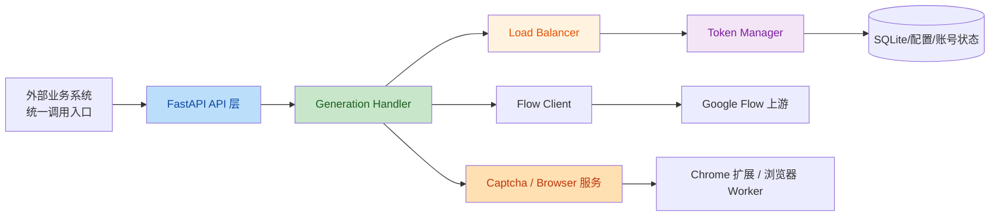
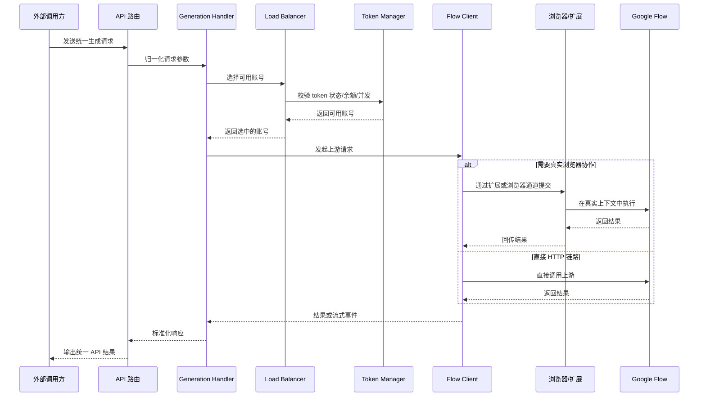

# 项目介绍：Google Flow 官方账号池统一 API 网关

## 1. 项目背景

这个项目面向一种非常明确的业务场景：

- 你手上有大量 Google Flow 官方账号
- 这些账号分散存在，缺少统一的服务入口
- 外部业务系统不希望直接管理单个账号、Cookie、项目页和验证码流程
- 你需要一个统一 API，把账号池的能力稳定地对外输出

这个仓库的目标，就是把“零散账号”收口成“统一能力”。

它不是一个简单的转发脚本，而是一个围绕账号池治理构建的完整服务层，负责处理：

- 统一 API 暴露
- 多账号调度
- Token 生命周期管理
- 并发控制与负载均衡
- 验证码处理
- 浏览器/插件协同
- 管理后台与运行态观测

## 2. 项目定位

可以把这个项目理解成：

> 一个专门为 Google Flow 官方账号池打造的统一接入层。

对外，它表现为一个 API 服务。

对内，它承担了账号池网关的职责：

- 管理账号登录态
- 维护账号可用性
- 自动选择最合适的账号处理请求
- 在需要真实浏览器上下文时，调度浏览器或扩展协同完成请求

对于你的使用场景，这个项目的核心价值不是“再包一层接口”，而是把账号资源、浏览器资源和请求流量统一组织起来，让大量官方账号真正变成可复用、可运维、可扩展的生产能力。

## 3. 解决的问题

如果没有这个项目，外部系统通常要直接面对很多复杂问题：

- 每个账号的 `session_token`、`access_token` 如何维护
- 哪个账号还能用，哪个账号已经过期或被限流
- 图片和视频请求该打到哪个账号
- 某些高风控场景何时必须走真实浏览器
- 验证码如何统一处理
- 多账号并发下如何避免把单个账号打爆
- 余额不足、429、项目上下文异常时如何自动摘除账号

这个项目把这些问题集中收口到了一个服务里。

## 4. 核心能力

从当前仓库实现来看，项目已经具备以下核心能力：

- 多账号统一管理，支持将大量 Flow 官方账号纳入同一个池子
- 对外提供统一 API Key，不暴露底层账号细节
- 同时兼容 OpenAI 风格接口和 Gemini 官方接口
- 按模型能力、账号等级、余额、并发状态自动选择可用账号
- 支持 `AT` 自动刷新，并在需要时尝试从浏览器侧同步 `ST`
- 支持 429 自动禁用和定时自动解禁
- 支持图片、视频、多图视频、首尾帧、放大等多类生成链路
- 支持第三方打码，也支持浏览器打码和扩展协作模式
- 提供管理后台、健康检查、Prometheus 指标和账号运行态视图

## 5. 整体架构

项目当前可以概括为四层：

- API 接入层
- 账号与调度层
- 上游调用与验证码层
- 浏览器执行与运维层

### 5.1 API 接入层

入口是基于 FastAPI 的服务，主要负责：

- 暴露统一 HTTP 接口
- 接收 OpenAI 兼容请求
- 接收 Gemini 官方 `generateContent` / `streamGenerateContent` 请求
- 对请求做格式归一化
- 将请求交给生成处理器统一执行

这一层解决的是“外部怎么以统一协议接入账号池”。

### 5.2 账号与调度层

这是项目最核心的部分，负责把多个官方账号真正组织成一个“池”。

关键职责包括：

- 管理账号启用/禁用状态
- 维护 `session_token`、`access_token`、账号余额、账号等级
- 按图片/视频能力过滤账号
- 按并发剩余量和运行负载选择账号
- 在 `default` 和 `polling` 两种调度模式之间切换
- 在必要时自动跳过余额耗尽、并发已满、能力不匹配或路由异常的账号

这一层决定了统一 API 的核心体验是否稳定。

### 5.3 上游调用与验证码层

当账号被选中后，项目会继续处理：

- 构造更贴近真实浏览器的请求头和指纹
- 调用 Google Flow 上游接口
- 根据场景切换图片、视频、多图视频等请求结构
- 根据配置决定是否走第三方打码、浏览器打码或扩展协作模式

这部分是项目“能不能真正把请求打通”的关键。

### 5.4 浏览器执行与运维层

项目不只依赖纯 HTTP 请求，还预留和实现了真实浏览器协作能力：

- `extension/` 下的浏览器扩展负责常连、状态上报和浏览器内动作协作
- `scripts/` 下的脚本负责浏览器 profile 启动桥和宿主机侧辅助能力
- 管理后台可查看账号、路由、浏览器 profile、运行态快照等信息

这使项目具备向“浏览器 Worker 集群”继续演进的基础。

## 6. 关键工作流

一个典型请求从进入到完成，大致经过下面的链路：

## 7. 仓库结构说明

当前项目目录大致可以这样理解：

- `src/main.py`
  - 服务启动入口，初始化数据库、调度器、浏览器服务和定时任务
- `src/api/`
  - 对外 API 与后台管理接口
- `src/core/`
  - 配置、鉴权、数据库、日志、模型解析、监控等基础能力
- `src/services/`
  - 账号管理、调度、上游调用、打码、缓存、代理、浏览器运行时等核心服务
- `extension/`
  - 浏览器扩展实现，用于浏览器侧状态采集和协作执行
- `scripts/`
  - 宿主机浏览器桥、profile 启动器等辅助脚本
- `static/`
  - 登录页、管理页、测试页等前端资源
- `tests/`
  - 关键服务与能力的自动化测试
- `docs/`
  - 架构、部署、浏览器 Worker、号池运维等专题文档

## 8. 为什么适合“号池项目”

结合你当前的目标，这个项目特别适合作为“Google Flow 官方账号池”的统一底座，原因在于它已经具备账号池落地需要的关键抽象：

- 账号不再直接暴露给业务系统
- 所有请求都通过统一 API 进入
- 系统可以在内部自动做账号选择与故障绕过
- 可以根据余额、能力、并发、状态做更细粒度的治理
- 已经具备浏览器上下文协作能力，不会被纯 HTTP 模式限制死

换句话说，这个项目不是“把很多账号拼在一起”，而是在把很多账号变成一个可调度的服务资源池。

## 9. 当前阶段的项目特点

从现有实现看，项目已经从单纯接口兼容，发展成了“账号池网关 + 浏览器协作平台”的形态，呈现出几个明显特征：

- 已经支持大号池的统一接入与集中运维
- 已经支持按账号维度做并发、代理、项目池和状态治理
- 已经开始把浏览器 profile、路由绑定、Worker 槽位视为重要运行资产
- 已经具备继续向真实浏览器 Worker 集群演进的代码基础

这意味着项目后续不仅能作为 API 服务继续扩展，也能逐步演进成更完整的账号池调度平台。

## 10. 适用场景

这套项目比较适合以下场景：

- 手里有大量 Google Flow 官方账号，需要统一对外提供能力
- 希望业务方只调用一个 API，不再关心底层账号切换
- 需要同时支持图片、视频和多种 Flow 模型能力
- 需要在验证码、浏览器上下文、账号健康状态之间做统一治理
- 希望后续进一步扩展为热池/冷池、浏览器 Worker 集群或多节点架构

## 11. 与现有文档的关系

这篇文档用于说明“这个项目是什么、为什么存在、整体是怎么工作的”。

如果你要继续深入，可结合以下专题文档阅读：

- `docs/googleflow-account-pool.md`
  - 面向大号池部署与接入方式
- `docs/hot-cold-pool-architecture.md`
  - 面向热池/冷池的长期运维思路
- `docs/browser-worker-cluster-architecture.md`
  - 面向浏览器 Worker 集群的演进方向
- `docs/browser-profile-host-bridge-service.md`
  - 面向宿主机浏览器 profile 启动桥的部署方式

## 12. 总结

如果用一句话概括当前项目：

> 这是一个围绕 Google Flow 官方账号池构建的统一 API 网关，负责把大量分散账号转化为可调度、可治理、可持续运维的服务能力。

对你的业务目标来说，它已经不只是“能用”，而是已经具备了账号池平台化的雏形。
