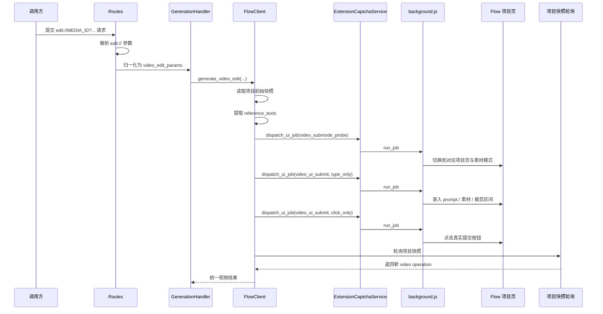

# 视频生成与编辑的扩展 UI 自动化链路说明

## 1. 背景

基于当前代码实现，`extension` 模式下的三条视频高风控链路已经明确切到浏览器扩展驱动的真实页面 UI 自动化：

- 文生视频
- 媒体工作台派生的图生视频
- 视频编辑

这里的核心判断不是“浏览器里代发一个 HTTP 请求”，而是：

- 后端先选择账号与项目
- 扩展绑定到正确账号的浏览器槽位
- 扩展进入对应的 Flow 项目页
- 在真实页面里做模式切换、输入、点击提交
- 后端再通过项目快照确认是否真的生成了新的视频任务

这份文档专门说明当前仓库中这条链路的实际代码流程、关键组件和现阶段风险点。

## 2. 审查结论

当前仓库里，`extension` 模式下的文生视频、媒体工作台派生图生视频、视频编辑已经走 UI 自动化主链路：

- 文生视频在 `generate_video_text()` 中优先进入 `_submit_video_text_via_extension_ui()`
- 媒体工作台里的图生视频会先绑定账号与项目，再把 `reference_media_id` / `selected_material_index` 透传到 `_submit_video_via_extension_ui()`
- 视频编辑在 `generate_video_edit()` 中优先进入 `_submit_video_edit_via_extension_ui()`
- 三者最终都会汇总到 `_submit_video_via_extension_ui()`
- 后端通过 `ExtensionCaptchaService.dispatch_ui_job()` 把任务派发给浏览器扩展
- 扩展侧 `background.js` 通过 `handleRunJob()` 和 `runVideoUiSubmit()` 在真实 Flow 页面中完成自动化提交

也就是说，当前项目已经形成了“后端调度 + 扩展派单 + 页面自动化 + 项目快照验收”的完整闭环。

## 3. 涉及文件

- `src/api/routes.py`
  - 统一入口，负责把 `edit://` 等引用解析成内部参数
- `src/core/video_reference.py`
  - 解析视频编辑引用，如 `edit://MEDIA_ID?...`
- `src/services/generation_handler.py`
  - 统一生成入口，选择 token，并将视频请求路由到 `FlowClient`
- `src/services/flow_client.py`
  - 负责视频链路的 UI 提交编排与结果确认
- `src/services/browser_captcha_extension.py`
  - 负责把 UI job 派发到对应的扩展连接
- `src/services/browser_profile_runtime.py`
  - 负责按 token 拉起或重建对应浏览器 profile
- `extension/background.js`
  - 扩展主进程，负责选择标签页、运行 UI job、回传结果
- `static/test.html`
  - 测试后台页面；当前图生视频入口只保留在媒体工作台派生链路，不再保留在“生成测试”tab
- `extension/video-edit-submit-hook.js`
  - 编辑视频提交请求的调试拦截钩子
- `docs/video-ui-state-machine.md`
  - 已存在的页面状态机说明，偏重 UI 状态归一化

## 4. 总体链路

```mermaid
flowchart LR
    A[统一 API 请求] --> B[Routes / GenerationHandler]
    B --> C[LoadBalancer 选择账号]
    C --> D[FlowClient]
    D --> E[_submit_video_via_extension_ui]
    E --> F[ExtensionCaptchaService.dispatch_ui_job]
    F --> G[background.js handleRunJob]
    G --> H[runVideoUiSubmit]
    H --> I[真实 Flow 项目页 UI 自动化]
    I --> J[扩展回传 ui_state/debug_context]
    J --> K[FlowClient 轮询项目快照]
    K --> L{发现新 video operation?}
    L -->|是| M[返回统一视频任务结果]
    L -->|否| N[按 UI 状态分类失败]

    style B fill:#bbdefb,color:#0d47a1
    style C fill:#fff3e0,color:#e65100
    style D fill:#c8e6c9,color:#1a5e20
    style F fill:#f3e5f5,color:#7b1fa2
    style H fill:#ffe0b2,color:#bf360c
    style K fill:#c8e6c9,color:#1a5e20
```



## 5. 文生视频链路

### 5.1 后端入口

文生视频请求在统一生成入口里完成以下步骤：

1. 校验模型
2. 选择视频可用 token
3. 获取或确认项目 `project_id`
4. 调用 `FlowClient.generate_video_text()`
5. 当 `captcha_method == "extension"` 且存在 `token_id` 与数据库上下文时，切换到 UI 提交分支

对应代码路径：

- `generation_handler.py` 负责统一路由到 `generate_video_text()`
- `flow_client.py` 负责在 `generate_video_text()` 中进入 `_submit_video_text_via_extension_ui()`

### 5.2 UI 提交编排

文生视频 UI 提交最终会进入 `_submit_video_via_extension_ui()`，该函数做的事情是：

- 读取项目当前快照，记录提交前已有的 video operations
- 根据模型 key 和宽高比推导 UI 上应选择的模型、时长和比例
- 先执行一次 `video_submode_probe` 预热页面
- 再执行一次 `video_ui_submit` 的 `type_only`
- 检查提交按钮是否被真正解锁
- 如果有必要，对 `type_only` 重试一次
- 最后执行一次 `video_ui_submit` 的 `click_only`
- 提交后反复读取项目快照，确认出现新的视频 operation

### 5.3 页面侧执行

扩展端 `background.js` 的 `handleRunJob()` 会：

- 找到最合适的 `labs.google` 标签页
- 必要时切到该 token 对应的 canonical project 页面
- 等待页面 ready
- 如果检测到应用错误页，先走恢复逻辑
- 调用 `runVideoUiSubmit()` 真正执行页面自动化

`runVideoUiSubmit()` 负责：

- 识别当前是文本模式还是素材模式
- 归一化到视频创建表面
- 定位 prompt 区域
- 处理智能体/对话抽屉/错误 surface 等干扰状态
- 在 `type_only` 阶段只输入不点击
- 在 `click_only` 阶段只点击真正的 submit 按钮
- 采集 `ui_state`、`steps`、`best_submit_candidate`、`frontend_errors`

## 6. 视频编辑链路

### 6.1 参数来源

编辑视频的统一 API 输入通过 `edit://` 方式传递参考视频与裁剪范围，例如：

```text
edit://MEDIA_ID?start_time=0.00&end_time=4.00
edit://MEDIA_ID?start_frame=0&end_frame=240
```

`routes.py` 会把这个引用解析成：

- `media_id`
- `start_frame_index / end_frame_index`
- 或 `start_seconds / end_seconds`
- `source_duration_seconds`

真正解析逻辑在 `src/core/video_reference.py`。

### 6.2 后端编排

视频编辑在 `generate_video_edit()` 中，当 `captcha_method == "extension"` 时会直接进入 `_submit_video_edit_via_extension_ui()`。

这一层会额外做两件事：

- 用 `get_flow_project_initial_data()` 读取项目快照
- 根据 `source_media_id` 从项目快照里提取参考文本 `reference_texts`

然后把这些信息一起传入 `_submit_video_via_extension_ui()`：

- `preferred_submode = "素材"`
- `reference_media_id = source_media_id`
- `reference_texts`
- 时间或帧范围参数

### 6.3 媒体工作台派生图生视频

当前图生视频不再作为测试后台“生成测试”tab 的独立入口存在，而是统一从媒体工作台的素材派生入口进入。

这条链路的关键约束是：

- 先确定账号与项目
- 再在同账号同项目下选择或上传来源图片
- 生成时把 `reference_media_id` 与 `selected_material_index` 一起透传给 UI 自动化
- 不允许先上传到 A 项目，再随机调度到 B 账号生成

### 6.4 编辑视频流程图



## 7. 扩展任务模型

当前扩展侧已经形成了清晰的 job 模型，`handleRunJob()` 支持的与视频链路直接相关的任务有：

- `ensure_project_page`
- `video_ui_probe`
- `video_ui_prepare`
- `video_ui_submit_probe`
- `video_ui_type_probe`
- `video_ui_submit`
- `video_submode_probe`

其中和正式提交流程最相关的是：

- `video_submode_probe`
  - 用于预热并确认当前页面能进入正确的视频子模式
- `video_ui_submit`
  - 真正执行 `type_only` 或 `click_only`

## 8. 页面执行阶段拆分

当前实现不是单次“输入并提交”，而是拆成两个阶段：

### 8.1 `type_only`

目标：

- 把 prompt 和视频参数写入页面
- 观察 submit 按钮是否已真正变为可点击
- 不在这一阶段点击提交

意义：

- 把“输入是否成功”和“点击是否成功”分离
- 避免把 UI 异常与真正提交失败混在一起

### 8.2 `click_only`

目标：

- 基于已经准备好的页面状态点击真正的提交按钮
- 采集点击后的页面状态、前端错误和请求钩子信息

最终成功判定不依赖“点到了按钮”，而依赖：

- 项目快照里是否出现新的 video operation

这也是当前实现里最关键的验收标准。

## 9. 成功与失败判定

后端并不会把“扩展返回 success”直接视为业务成功，而是继续做二次确认：

- 提交前：记录当前项目里已有的视频 operation
- 提交后：轮询项目快照
- 只有出现新的 operation，才认为这次 UI 提交真正成功

如果没有出现新的 operation，会继续基于 `ui_state` 分类：

- `image_mode`
- `create_menu_open`
- `prompt_placeholder`
- `agent_or_chat_surface`
- `unknown`

其中前四类被视为“可恢复但当前落错页面表面”的失败。

## 10. 视频编辑调试钩子

`extension/video-edit-submit-hook.js` 当前是一个调试能力，不是默认主流程。

它的作用是：

- 拦截 `/video:batchAsyncGenerateVideoEditVideo`
- 记录编辑请求体
- 在调试模式下重写 `mediaId`、时间范围或帧范围

它只会在扩展 job payload 显式传入 `debug_video_edit_submit_hook_mode` 时注入执行。

因此，正常业务链路的主逻辑仍然是：

- 页面自动化选素材
- 页面自动化设置编辑区间
- 页面内真实提交

而不是依赖调试 hook 常态化改写请求。

## 11. 当前实现风险点

### 风险 1：分阶段 UI 提交与强制重启浏览器之间存在状态丢失风险

当前 `_submit_video_via_extension_ui()` 会依次派发：

- `video_submode_probe`
- `video_ui_submit(type_only)`
- `video_ui_submit(click_only)`

但 `dispatch_ui_job()` 对这些视频 job 会先调用 `ensure_token_browser_ready(force_relaunch=True)`。

这意味着当前实现有概率在 `type_only` 和 `click_only` 之间重建浏览器或标签页上下文，从而丢失：

- 已输入的 prompt
- 已切换好的页面模式
- 已选择的素材或编辑区间

如果 `click_only` 阶段没有继承到 `type_only` 的页面状态，就会退化成“在一个新页面里只尝试点击”。

### 风险 2：只有 `extension` 模式走了真 UI 提交

文生视频、媒体工作台派生图生视频和视频编辑当前只在 `captcha_method == "extension"` 时明确走 UI 自动化分支。

而 `personal` / `browser` 模式下，视频提交仍然主要走浏览器上下文内的 `submit_json_via_browser()`。

如果上游风控已经要求“必须通过真实官方页面 UI 提交”，那么这两种模式下的视频链路仍然存在失效风险。

## 12. 建议的后续演进

结合当前实现，比较合理的下一步是：

1. 保证 staged submit 的浏览器上下文连续性
2. 把 `type_only` 和 `click_only` 固定在同一个在线 slot / 同一标签页里执行
3. 明确 `extension` 作为视频高风控链路的唯一正式路径
4. 将 `personal` / `browser` 是否迁移到 UI 自动化单独规划
5. 保留“项目快照验收”这套最终成功判定，不要回退到“按钮点击即成功”

## 13. 与现有文档的关系

这份文档说明的是“当前代码里视频 UI 自动化主流程是怎么跑起来的”。

建议结合以下文档一起看：

- `docs/video-ui-state-machine.md`
  - 解释页面状态归一化与错误分类
- `docs/browser-worker-cluster-architecture.md`
  - 解释扩展/浏览器 worker 未来如何平台化扩展
- `docs/browser-profile-host-bridge-service.md`
  - 解释宿主机 browser profile 启动桥的部署方式

## 14. 总结

当前仓库已经不是“视频在浏览器里补 token 再代发请求”这么简单，而是已经形成了：

- 后端选账号
- 后端派 UI job
- 扩展执行页面自动化
- 项目快照验收新任务

这条完整闭环。

在当前上游风控环境下，这条链路就是项目里最关键的视频生产路径。
