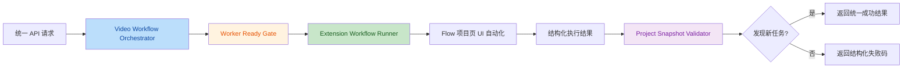
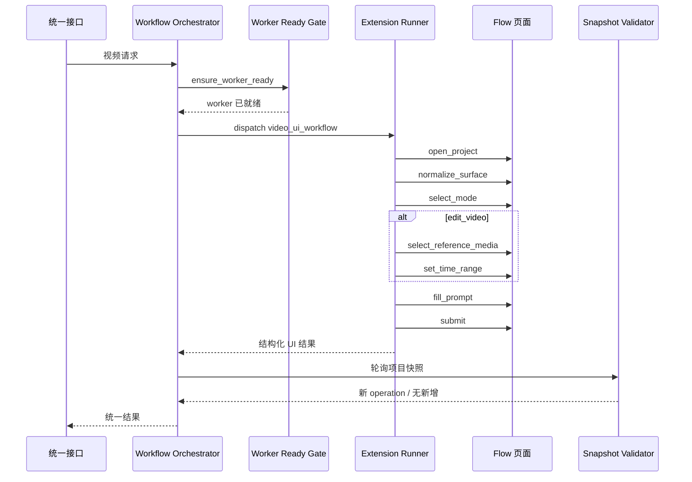

# 视频 UI 自动化重构设计

## 1. 背景

当前视频链路已经进入一个新的现实约束：

- 文生视频、媒体工作台派生的图生视频、编辑视频都属于高风控能力
- 仅靠服务端 HTTP 代发已经不稳定
- 真实可用链路应以浏览器扩展驱动的官方页面 UI 自动化为核心

因此，后续设计不应继续围绕“如何补 token 再代发接口”展开，而应围绕下面这件事展开：

> 把一次视频生成/编辑请求，稳定地映射成一次完整、连续、可观测、可验收的浏览器 UI workflow。

## 2. 当前问题

当前实现里最根本的问题，不是某个函数写得差，而是抽象层次出了问题：

- 一个视频任务被拆成多个相互依赖页面状态的子 job
- 后端与扩展同时持有 UI 状态机，职责边界不清
- 调试逻辑、页面探测、提交流程和浏览器准备流程高度耦合
- 页面自动化缺少统一的 workflow 概念
- 成功与失败的信号虽然已有雏形，但没有收敛为统一执行模型

这会导致两个后果：

- 代码越修越散
- 即使修好单点问题，也无法让整体流程变得可维护

## 3. 重构目标

本次重构目标不是“微调旧逻辑”，而是建立一个新的最小闭环：

1. 接口层收到视频请求
2. 后端选择账号、项目和 worker
3. 扩展在同一个连续上下文里跑完整个 UI 自动化流程
4. 后端用项目快照验收新任务是否真的创建成功

对于视频编辑，还需要额外覆盖：

- 进入编辑模式
- 选择参考素材
- 设置时间范围或帧范围

## 4. 非目标

这次设计刻意不追求以下内容：

- 不追求兼容现有全部旧 job 语义
- 不追求保留 `probe/type/click` 的阶段接口
- 不追求第一版就覆盖所有模型细枝末节
- 不追求完全依赖录制回放，无语义抽象地复制人工操作

## 5. 设计原则

### 5.1 一个视频任务就是一个 workflow

一次视频生成或编辑请求，应该对应一个完整的 workflow run，而不是多个需要共享页面状态的小 job。

### 5.2 准备阶段和执行阶段分离

允许在 workflow 开始前做：

- 浏览器重启
- 插件刷新
- worker 绑定修复

但不允许在 workflow 执行过程中再重启浏览器或切换到另一个无关上下文。

### 5.3 后端只负责编排与验收

后端只负责：

- 账号选择
- worker 准备
- workflow 派发
- 结果汇总
- 项目快照验收

后端不再细粒度介入页面内部的输入、按钮判断和页面状态机分支。

### 5.4 扩展只负责执行

扩展负责：

- 打开项目页
- 归一化页面状态
- 选择模式
- 选择素材
- 设置时间范围
- 输入 prompt
- 点击提交
- 回传结构化执行结果

### 5.5 成功标准只有一个

UI 自动化侧的“点击成功”不是最终成功。

最终成功标准仍然是：

- 项目快照出现新的 video operation

## 6. 新架构概览



## 7. 新的任务模型

建议放弃旧的碎片化 job，统一成一个主任务：

- `video_ui_workflow`

### 7.1 请求结构

建议的 payload：

```json
{
  "job_type": "video_ui_workflow",
  "run_id": "uuid",
  "token_id": 123,
  "route_key": "token123-worker",
  "project_id": "flow-project-id",
  "workflow_mode": "text_to_video",
  "prompt": "生成一个城市夜景镜头",
  "model": {
    "model_key": "veo-3.0-generate-001",
    "display_name": "Veo 3"
  },
  "video_options": {
    "duration_seconds": 8,
    "aspect_ratio": "16:9",
    "count": 1
  },
  "edit_options": {
    "reference_media_id": null,
    "start_seconds": null,
    "end_seconds": null,
    "start_frame_index": null,
    "end_frame_index": null
  },
  "runtime_options": {
    "worker_reset_policy": "if_needed",
    "capture_trace": true,
    "capture_screenshots": true
  }
}
```

### 7.2 两种模式

- `text_to_video`
  - 只需要处理视频创建模式、prompt、模型和提交
- `edit_video`
  - 需要额外处理素材选择和时间范围设置

## 8. 新的执行阶段

一个 workflow run 内部保留阶段，但这些阶段只是同一个 job 内的步骤，不再拆成多个独立 job。

### 8.1 `prepare_context`

目标：

- 选定对应 token 的 worker
- 确认插件版本、route 绑定、账号归属正确
- 如有必要，在这一步做 hard reset

### 8.2 `open_project`

目标：

- 打开或切到指定 `project_id` 页面
- 等待页面 ready
- 采集初始上下文、URL、标题和页面稳定信号

### 8.3 `normalize_surface`

目标：

- 消除聊天抽屉、智能体、错误提示、创建菜单等干扰状态
- 让页面进入标准的视频工作表面

### 8.4 `select_mode`

目标：

- 文生视频：确保落在文本视频模式
- 图生视频：确保落在参考素材模式，并命中当前项目里的目标图片素材
- 编辑视频：确保落在素材/编辑模式

### 8.5 `select_reference_media`

仅用于 `edit_video`。

目标：

- 在项目素材或时间线入口里选中指定 `reference_media_id`
- 确认所选素材与目标 media id 对应

### 8.6 `set_time_range`

仅用于 `edit_video`。

目标：

- 根据秒数或帧号设置裁剪区间
- 回传归一化后的实际时间范围

### 8.7 `fill_prompt`

目标：

- 找到正确 prompt 编辑器
- 清空旧内容
- 输入新的 prompt
- 确认输入结果已进入真正的编辑器状态，而不是 placeholder 假状态

### 8.8 `submit`

目标：

- 定位真实提交按钮
- 触发真实点击
- 记录点击前后状态和前端反馈

### 8.9 `collect_post_submit`

目标：

- 收集点击后的前端状态、错误提示、可能的提交请求摘要
- 为后端验收失败时提供上下文

## 9. 执行时序



## 10. 结果结构

建议扩展返回统一结构：

```json
{
  "success": true,
  "run_id": "uuid",
  "workflow_mode": "edit_video",
  "stage": "submit",
  "submitted": true,
  "page_url": "https://labs.google/fx/zh/tools/flow/project/xxx",
  "ui_state": {
    "mode": "video",
    "submode": "素材",
    "prompt_ready": true,
    "submit_button_ready": true
  },
  "steps": [],
  "artifacts": {
    "screenshots": [],
    "dom_snapshots": [],
    "network_summary": []
  },
  "error_code": "",
  "error_message": "",
  "debug_context": {}
}
```

其中：

- `success`
  - 表示 workflow 本身是否顺利跑完
- `submitted`
  - 表示 UI 层是否执行了真实提交动作
- 最终业务成功仍由后端快照验收决定

## 11. 失败码设计

建议失败码收敛为以下几类：

- `WORKER_NOT_READY`
- `PROJECT_OPEN_FAILED`
- `PAGE_NOT_STABLE`
- `SURFACE_NORMALIZE_FAILED`
- `MODE_SELECT_FAILED`
- `REFERENCE_MEDIA_NOT_FOUND`
- `TIME_RANGE_SET_FAILED`
- `PROMPT_INPUT_FAILED`
- `SUBMIT_BUTTON_NOT_FOUND`
- `SUBMIT_ACTION_FAILED`
- `SUBMIT_ACCEPTED_BUT_NO_OPERATION`
- `UNCLASSIFIED_UI_ERROR`

这样后端可以做更清晰的重试与运维决策。

## 12. 浏览器重启策略

建议不要采用“每个子步骤都强制重启”的模型，而采用三态策略：

### 12.1 `warm`

- worker 在线
- 插件版本正确
- route/email 绑定正确
- 直接执行 workflow

### 12.2 `soft_reset`

- 不重启浏览器
- 仅重新打开项目页、关闭干扰面板、清理页面脏状态

### 12.3 `hard_reset`

- 重启浏览器并重新加载扩展
- 仅在以下场景触发：
- 扩展版本落后
- worker 离线
- route 绑定错乱
- 连续多次 workflow 失败
- 页面彻底卡死

结论是：

- 可以在 workflow 开始前 hard reset
- 不应在 workflow 中途重启

## 13. 关于“人工示教采集”的可行性

你的想法是合理的，而且很适合这类 UI 自动化项目。

但要区分三种不同路线。

### 13.1 路线 A：纯录制回放

做法：

- 录下人工点击、输入、滚动、坐标和时间间隔
- 运行时原样回放

优点：

- 实现快
- 前期容易看到结果

缺点：

- 对动态 DOM 极脆弱
- 一旦页面布局、文案或控件位置变化就失效
- 无法优雅处理 `prompt`、`media_id`、时间范围等动态参数

结论：

- 不建议作为正式方案

### 13.2 路线 B：纯语义编码

做法：

- 全部动作都手写成语义步骤
- 例如“选择素材”“设置时间范围”“输入 prompt”

优点：

- 可维护性最好
- 适合长期演进

缺点：

- 初始开发成本高
- 需要自己摸清大量页面细节

结论：

- 适合作为最终执行框架

### 13.3 路线 C：示教采集 + 语义模板化

做法：

- 开启自动捕获模式
- 你在浏览器里人工完整跑一次“黄金流程”
- 扩展记录人工过程中的：
  - DOM 路径与候选锚点
  - 控件附近文案
  - 操作前后截图
  - 关键网络请求摘要
  - 页面状态切换
- 然后把这份原始示教记录转换成“语义 workflow 模板”

优点：

- 比纯手写更快落地
- 比纯录制回放更稳定
- 更适合处理动态参数

结论：

- 这是当前项目最推荐的方案

## 14. 推荐的示教采集方案

建议采用：

> 示教采集用于发现页面路径和稳定锚点，正式执行仍使用语义 workflow operator，而不是回放像素级动作。

### 14.1 采集时记录什么

建议扩展开启 `capture_mode` 后记录以下信息：

- 当前 URL
- 页面标题
- 页面 readyState
- 每次点击目标的：
  - tag
  - 文本
  - aria-label
  - role
  - `data-*`
  - 附近兄弟节点与父节点文案
  - 元素截图或框选区域
- 每次输入目标的：
  - 编辑器类型
  - Slate/textarea/contenteditable 特征
  - 输入前后 DOM 状态
- 每次页面显著变更的：
  - Mutation 摘要
  - 新出现的菜单、弹窗、按钮
- 提交阶段的：
  - 提交按钮候选集
  - 点击前后按钮状态
  - 相关请求摘要

### 14.2 采集后如何产出模板

不要直接保存为“点击第 3 个按钮”。

而是转成这种模板：

```json
{
  "workflow_mode": "edit_video",
  "steps": [
    { "op": "open_project" },
    { "op": "ensure_video_surface" },
    { "op": "select_reference_media", "param": "reference_media_id" },
    { "op": "set_time_range", "params": ["start_seconds", "end_seconds"] },
    { "op": "fill_prompt", "param": "prompt" },
    { "op": "submit" }
  ]
}
```

也就是说：

- 示教记录告诉系统“你是怎么找到这些控件的”
- 最终模板只保留“要完成什么操作”

### 14.3 动态参数怎么处理

你提到一个关键点：

- 有些接口参数是动态的，不能完全照人工流程里的固定值回放

这正是为什么不能用纯录制回放。

建议做法是把动态参数分成三类：

- 文本参数
  - 如 `prompt`
- 资源参数
  - 如 `reference_media_id`
- 区间参数
  - 如 `start_seconds` / `end_seconds` 或帧范围

示教记录里只保留参数位置和控件类型，不保留业务值本身。

例如：

- 你人工示教时输入的是“让人物向前走”
- 模板里只记录这里对应 `prompt`
- 运行时再由接口真正填入用户请求里的 prompt

## 15. 为什么推荐“示教采集 + 语义模板化”

因为它同时解决了两个现实问题：

### 15.1 你知道正确业务流程，但不一定知道最佳技术锚点

人工跑一遍可以告诉系统：

- 哪些按钮才是对的
- 页面切换顺序是什么
- 编辑视频到底先选素材还是先切模式

### 15.2 接口参数是动态的

模板化后，真正执行时仍然可以动态注入：

- prompt
- 模型
- 参考素材 id
- 开始/结束时间
- 时长和比例

## 16. 一个更实用的落地方式

如果按当前项目节奏推进，我建议分两期。

### 16.1 第一期：先做稳定 workflow，不先做全自动示教生成

先完成：

- 新的 `video_ui_workflow`
- 统一结果结构
- 统一失败码
- 统一 trace 采集
- 人工可读的运行回放日志

同时做一个“捕获模式”，但暂时只用于辅助开发，不自动产出模板。

### 16.2 第二期：再做示教转模板

当第一期 workflow 已经跑通后，再补：

- 人工示教采集器
- 原始操作流分析器
- 语义模板生成器
- 参数占位符标注器

这样风险更低，也更符合当前项目阶段。

## 17. 我对当前项目的推荐方案

综合来看，我推荐：

1. 先重构成单一 `video_ui_workflow`
2. 保留 hard reset，但只允许发生在 workflow 之前
3. 建立统一 trace 采集能力
4. 先把文生视频、媒体工作台派生图生视频、编辑视频各跑通一条最小闭环
5. 再引入“人工示教采集 + 语义模板化”

不推荐：

- 继续扩展旧的 `probe/type/click` 三段式
- 直接依赖录制回放作为正式执行器
- 在 workflow 过程中做浏览器重启

## 18. 迁移计划

### 阶段 1：冻结旧逻辑

- 不再继续向旧视频 job 加新分支
- 旧链路仅用于对照和回滚

### 阶段 2：旁路新执行器

- 新增 `video_ui_workflow`
- 后端统一接入文生视频、媒体工作台派生图生视频、编辑视频三类任务
- 测试后台的图生视频入口不再保留在“生成测试”tab，而是统一从媒体工作台派生进入

### 阶段 3：建立统一 trace

- 截图
- DOM 摘要
- 候选按钮集
- 页面状态摘要
- 请求摘要

### 阶段 4：引入 capture mode

- 允许人工跑一遍流程
- 把关键 UI 锚点和路径采出来

### 阶段 5：切流与删旧

- 新 workflow 稳定后切主流量
- 最后删除旧 job 及相关耦合逻辑

## 19. 总结

这次重构的核心，不是把旧代码修顺，而是把问题重新定义正确：

- 一个视频请求，就是一个完整 workflow
- 浏览器准备和 workflow 执行是两层
- 示教采集可以帮助我们发现可靠路径
- 正式执行必须建立在语义步骤和动态参数注入之上

如果只用一句话概括推荐方案：

> 用“单一 workflow + 统一 trace + 示教采集辅助模板化”替代当前碎片化视频 job 体系。
